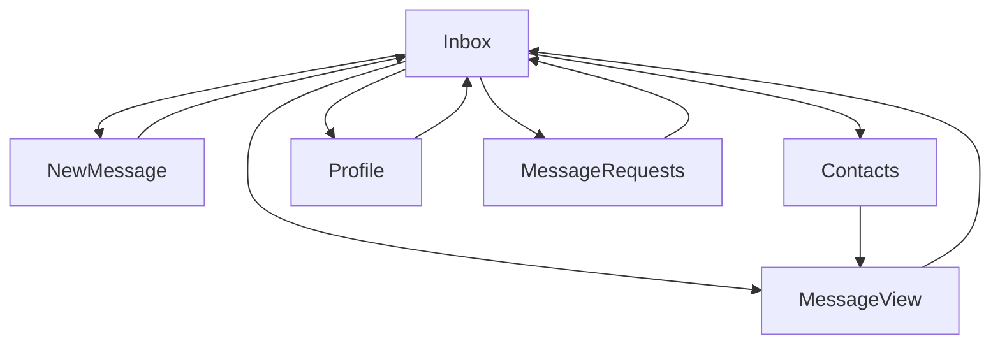

# Screens and Flows

This document defines the screen structure and navigation flows of the SMP TUI.

---

## 1. Navigation Model

The TUI follows a **single-active-screen model**.

- Only one primary screen visible at a time
- Navigation via keyboard shortcuts
- Global navigation keys available from any screen

---

## 2. Global Navigation

| Key | Action           |
| --- | ---------------- |
| i   | Inbox            |
| r   | Message Requests |
| n   | New Message      |
| c   | Contacts         |
| p   | Profile          |
| d   | Debug (optional) |
| q   | Quit             |

---

## 3. Screen Overview

Main screens:

1. Inbox
2. Message View
3. Message Requests
4. New Message
5. Contacts
6. Profile
7. Debug (only for developers not visible or accessable for users)

---

## 4. Inbox Screen

### Purpose

Display trusted conversations.

---

### Layout

```text
+---------------------------------------------------------------------------------+
| Inbox                                                                           |
+---------------------------------------------------------------------------------+
| > alice#7f2a91                                                    [Trusted]     |
|   bob#a81c3e                                                      [Accepted]    |
|   charlie#91af7c                                                  [QR Verified] |
+---------------------------------------------------------------------------------+
```

### Actions

| Key   | Action            |
| ----- | ----------------- |
| Enter | Open conversation |
| ↑/↓   | Navigate          |
| n     | New message       |

---

## 5. Message View

### Purpose

Display conversation with a contact.

### Layout

```text
+------------------------------------------------------------------------------+
| Conversation with alice#7f2a91                                    [Trusted]  |
+------------------------------------------------------------------------------+
|                                                                              |
| alice: Hello                                                      [10:05 AM] |
|                                                                              |
| You: Hi                                                           [10:06 AM] |
|                                                                              |
| alice: How are you?                                               [10:07 AM] |
|                                                                              |
|                                                                              |
+------------------------------------------------------------------------------+
| > Type message...                                                            |
+------------------------------------------------------------------------------+
```

### Actions

| Key   | Action        |
| ----- | ------------- |
| Enter | Send message  |
| Esc   | Back to inbox |

---

## 6. Message Requests Screen

### Purpose

Handle unkonwn senders.

### Layout

```text
+--------------------------------------+
| Message Requests                     |
+--------------------------------------+
| vish#7f2a91   FP:91AF 7C22           |
|                                      |
| [A]ccept  [I]gnore  [B]lock          |
+--------------------------------------+
```

### Actions

| Key | Action        |
| --- | ------------- |
| A   | Accept        |
| I   | Ignore        |
| B   | Block         |
| Esc | Back to inbox |

---

## 7. New Message Screen

### Purpose

Send a new message.

### Layout

```text
+------------------------------------------------------------------------------+
| New Message                                                                  |
+------------------------------------------------------------------------------+
| To:                                                                          |
| [alice#7f2a91]                                                               |
|                                                                              |
| Message:                                                                     |
| >                                                                            |
+------------------------------------------------------------------------------+
| [S]end                                                                       |
+------------------------------------------------------------------------------+
```

### Behavior

- Validate full username format
- Resolve identity before sending

### Actions

| Key   | Action        |
| ----- | ------------- |
| Enter | Send message  |
| Esc   | Back to inbox |

---

## 8. Contacts Screen

### Purpose

View known contacts.

### Layout

```text
+--------------------------------------+
| Contacts                             |
+--------------------------------------+
| alice#7f2a91   [QR Verified]         |
| bob#a81c3e     [Accepted]            |
+--------------------------------------+
```

### Actions

| Key   | Action            |
| ----- | ----------------- |
| Enter | Open conversation |
| Esc   | Back to inbox     |

---

## 9. Profile Screen

### Purpose

Show user identity.

### Layout

```text
+------------------------------------------------------------------------------+
| Profile                                                                      |
+------------------------------------------------------------------------------+
| Username: alice#7f2a91                                                       |
| Fingerprint: 91AF 7C22                                                       |
| Trust: Self                                                                  |
+------------------------------------------------------------------------------+
```

### Actions

| Key | Action        |
| --- | ------------- |
| Esc | Back to inbox |

---

## 10. Debug Screen

### Purpose

Development visibility.

### Layout

```text
+------------------------------------------------------------------------------+
| Debug                                                                        |
+------------------------------------------------------------------------------+
| [Session State]                                                              |
| [Last Errors]                                                                |
| [Network Status]                                                             |
+------------------------------------------------------------------------------+
```

### Actions

| Key | Action        |
| --- | ------------- |
| Esc | Back to inbox |

### Shows:

- Session state.
- Last errors.
- Network status.

---

## 11. Navigation Flow



---

## 12. Key Bindings Summary

| Key | Inbox | Message View | Message Requests | New Message | Contacts | Profile | Debug |
| --- | ----- | ------------ | ---------------- | ----------- | -------- | ------- | ----- |
| i   | ✓     | ✓            | ✓                | ✓           | ✓        | ✓       | ✓     |
| r   | ✓     | ✓            | ✓                | ✓           | ✓        | ✓       | ✓     |
| n   | ✓     | ✓            | ✓                | ✓           | ✓        | ✓       | ✓     |
| c   | ✓     | ✓            | ✓                | ✓           | ✓        | ✓       | ✓     |
| p   | ✓     | ✓            | ✓                | ✓           | ✓        | ✓       | ✓     |
| d   | ✓     | ✓            | ✓                | ✓           | ✓        | ✓       | ✓     |
| q   | ✓     | ✓            | ✓                | ✓           | ✓        | ✓       | ✓     |

---

## 13. UX Rules

- Always show trust level
- Always show identity clearly
- Never hide security warnings

---

## 14. Error Handling

Errors displayed inline:

```text
[Error] Identity not found
```

---

## 15. Summary

The TUI structure provides:

- Clear navigation
- Secure interaction flows
- Visibility into trust and identity

It ensures usability without compromising security.

---
