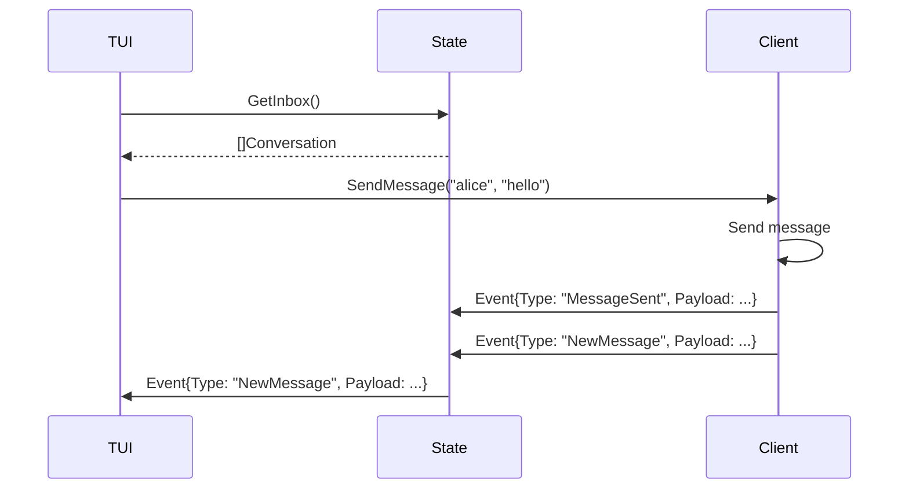

# State Integration

This document defines how the TUI interacts with the SMP client state.

The TUI does NOT own state. It:

- Reads state from the client
- Sends actions to the client
- Reacts to state changes

---

## 1. Design Principles

- Unidirectional data flow
- No direct state mutation by TUI
- Event-driven updates
- Clear separation of concerns

---

## 2. Architecture Model

```text
Core Client State
      ↑
State Manager
      ↑
Event Bus
      ↑
TUI Layer
```

---

## 3. State Access

TUI reads state via:

```go
type StateProvider interface {
    GetInbox() []Conversation
    GetRequests() []Request
    GetContacts() []Contact
    GetProfile() Profile
}
```

### Rule

- Read-only access
- No direct modification

---

## 4. Actions (Commands)

TUI triggers actions via:

```go
type ActionHandler interface {
    SendMessage(to string, message string) error
    AcceptRequest(identity string) error
    IgnoreRequest(identity string) error
    BlockUser(identity string) error
    ResolveIdentity(username string) (Identity, error)
}
```

---

## 5. Event System

Client emits events:

```go
type Event struct {
    Type string
    Payload interface{}
}
```

### Event Types

| Event           | Description         |
| --------------- | ------------------- |
| NewMessage      | Message received    |
| MessageSent     | Message sent        |
| RequestReceived | New message request |
| TrustUpdated    | Trust change        |
| Error           | Error occurred      |

---

## 6. Event Flow



```text
Client → Event Bus → TUI → UI Update
```

Example:

```text
NewMessage →
    Update Inbox →
    Refresh Screen
```

---

## 7. Screen Binding

Each screen subscribes to relevant state:

| **Screen**   | **Data Source** |
| ------------ | --------------- |
| Inbox        | Conversations   |
| Requests     | Request list    |
| Profile      | Identity data   |
| Message View | Messages        |

---

## 8. Action Flow

```text
User Input →
    TUI →
        ActionHandler →
            Core Logic →
                State Update →
                    Event →
                        TUI Refresh
```

---

## 9. Async Handling

All actions must be:

- Non-blocking
- Handled asynchronously

Example:

```text
SendMessage →
    Immediate UI feedback →
    Background send →
    Event on success/failure
```

---

## 10. Error Handling

Errors propagate as events:

```text
Error →
    Event →
    Display in UI
```

### Rule

- No silent failures

---

## 11. State Consistency

TUI must:

- Always reflect latest state
- Not cache critical state independently

---

## 12. Security Constraints

TUI must NOT:

- Access private keys
- Modify session state
- Bypass trust checks

---

## 13. Performance Considerations

- Avoid full screen re-render
- Update only changed components
- Debounce rapid updates

---

## 14. Summary

The TUI interacts with the client via:

- StateProvider (read)
- ActionHandler (write)
- Event system (updates)

This ensures:

- Clean separation
- Secure interactions
- Consistent UI behavior

---
